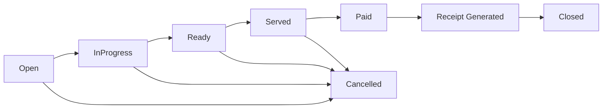
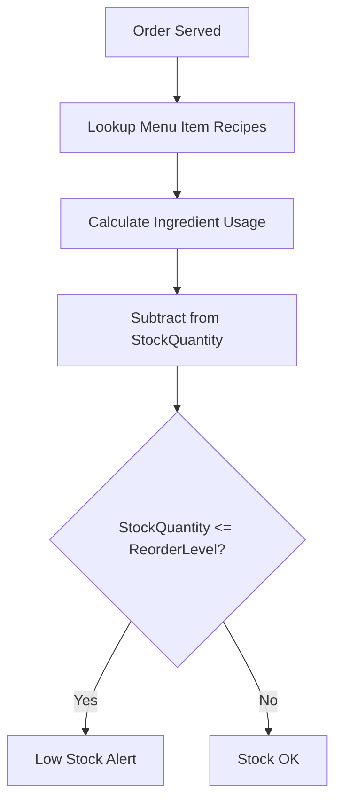
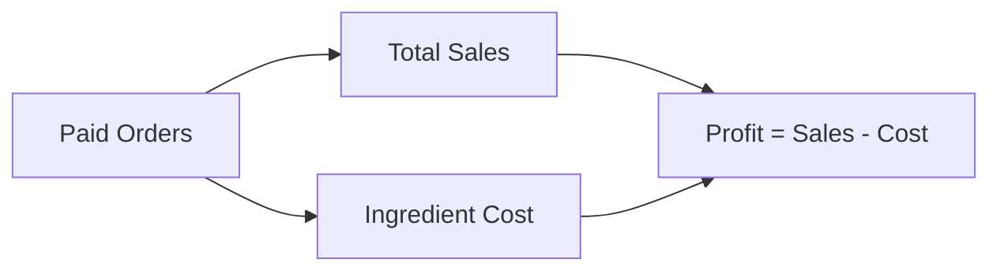
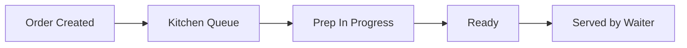
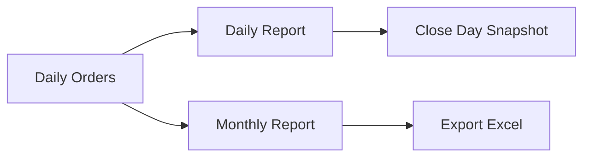
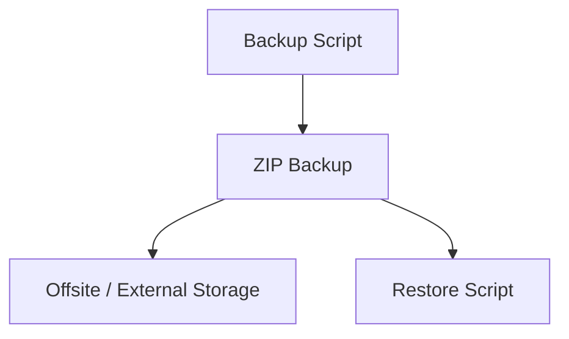

# Restaurant POS

Single-location Restaurant POS with .NET 8 + SQLite backend and React (Vite) frontend.

Features:

- Auth + role-based access (Admin, Waiter, Cashier)
- Menu with images, categories, ingredients
- Orders flow + kitchen screen
- Payments + receipts (PDF)
- Inventory + cost tracking
- Reports (daily + monthly)
- Backups + restore scripts

## Business flow (how the POS works)

### Visual flow (graphs)

Order lifecycle (with payment + receipt):



Inventory usage + low stock:



Profit calculation:



Kitchen ticket flow:



Reports + close day:



Backups + restore:



### Users & roles

- **Admin**: full access (menu, inventory, reports, users, settings).
- **Waiter**: creates orders, sends to kitchen, updates status.
- **Cashier**: takes payments and closes orders.

### Menu & pricing

- Menu items have a price, category, and optional image.
- Menu items can have **recipes** (ingredients + quantities).
- Those recipes are used to calculate **ingredient usage** and **cost**.

### Orders lifecycle

Order status flow:
`Open → InProgress → Ready → Served → Paid → Closed` (or `Cancelled`)

- **Open**: created by waiter.
- **InProgress/Ready**: kitchen workflow.
- **Served**: waiter confirms delivery to table.
- **Paid**: cashier records payment.
- **Closed**: final state after payment (or cancelled if voided).

### Payments & receipts

- Payments are recorded against an order with method + amount.
- Receipt PDF is generated from the order, payments, and shop profile.
- Currency is displayed as **MMK** across UI and reports.

### Inventory & ingredient usage

Ingredients have:
- **StockQuantity**
- **ReorderLevel**
- **CostPerUnit**
- **Unit** (kg, each, fillet, etc.)

When an order is marked **Served**:
- the system calculates required ingredient usage from the recipe
- it subtracts `Quantity * recipe` from **StockQuantity**
- it writes a stock adjustment record for auditability

Low stock logic:
- An ingredient is **low stock** when `StockQuantity <= ReorderLevel`
- Dashboard + Inventory screens show low stock alerts

### Ingredient cost & profit

Cost basis:
- Uses **recipe usage** from **paid orders only**
- Ingredient cost per order = sum(recipe quantity * ingredient cost)

Daily/Monthly profit:
```
Profit = TotalSales - IngredientCost
```

### Shop profile (receipt header)

Admin can edit:
- Shop name
- Address
- Phone
- Logo (PNG)

These values appear on receipts and printouts.

## Staff quick start

**Waiter**
1. Login → Orders
2. Select table → Add items → Create order
3. Watch Kitchen screen → mark Served when delivered

**Kitchen**
1. Open Kitchen screen
2. Move orders to InProgress → Ready

**Cashier**
1. Open Orders → select Paid order
2. Enter payment → print receipt

**Admin**
1. Manage menu, categories, ingredients
2. Update shop location (receipt header)
3. Run reports + close day
4. Run backups

## Prereqs

- .NET SDK 8
- Node.js 18+ (for frontend)

## Quick start (dev)

1. Start API + Web (dev)

```
.\RestaurantPos.Start.cmd
```

This runs:

- React build (Vite)
- Copies build into API wwwroot/app
- Starts the API

Default URLs:

- API: http://localhost:5268
- Web: served by API at http://localhost:5268

Default admin (first run only):

- Username: `admin`
- Password: `admin123`

Change this immediately in production.

## Manual run (dev)

API only:

```
cd RestaurantPos.Api
dotnet run
```

Web only (dev):

```
cd RestaurantPos.Web
npm install
npm run dev
```

## Production config

Set these before production:

- JWT key: must be at least 32 chars.
- CORS origins: must not include localhost.
- DB path: use absolute path.

Recommended (Windows):

```
setx Jwt__Key "PUT_A_32+_CHAR_SECRET_HERE"
```

In `RestaurantPos.Api/appsettings.Production.json`:

- `ConnectionStrings:DefaultConnection`
- `Cors:Origins`

## Go-Live checks

Runs config validation + health check:

```
.\RestaurantPos.GoLive.cmd
```

## Backup

Create a backup zip:

```
.\RestaurantPos.Backup.cmd
```

Backups go to:

- `Backups\RestaurantPos_YYYYMMDD_HHMMSS.zip`

## Restore

Restore from a backup zip:

```
.\RestaurantPos.Restore.cmd -ZipPath "Backups\\RestaurantPos_YYYYMMDD_HHMMSS.zip"
```

## Schedule nightly backups (Windows Task Scheduler)

Create task:

```
.\RestaurantPos.ScheduleBackup.cmd
```

Remove task:

```
.\RestaurantPos.RemoveBackupTask.cmd
```

## Health check

```
GET /health
```

## Hosting (Windows)

Recommended: run the API as a Windows Service or behind IIS.
Minimal approach:

1. Publish API:

```
dotnet publish RestaurantPos.Api -c Release -o C:\RestaurantPos\app
```

2. Configure `appsettings.Production.json` in the publish folder.
3. Set `Jwt__Key` env var on the server.
4. Start:

```
C:\RestaurantPos\app\RestaurantPos.Api.exe
```

## Production deployment (Windows Server + IIS)

### 1) Install prerequisites

- IIS (with ASP.NET Core Hosting Bundle for .NET 8)
- .NET 8 Hosting Bundle (installs ASP.NET Core Module for IIS)

### 2) Publish the API

```
dotnet publish RestaurantPos.Api -c Release -o C:\RestaurantPos\app
```

### 3) Prepare data folder

```
mkdir C:\RestaurantPos\data
```

Ensure your `appsettings.Production.json` has:

```
"ConnectionStrings": {
  "DefaultConnection": "Data Source=C:\\RestaurantPos\\data\\restaurantpos.db"
}
```

### 4) Set environment variables (system)

Set a strong JWT key:

```
setx Jwt__Key "PUT_A_32+_CHAR_SECRET_HERE"
```

Optional: set ASPNETCORE_ENVIRONMENT=Production.

### 5) Configure CORS

Update `appsettings.Production.json`:

```
"Cors": {
  "Origins": ["https://your-pos-domain.com"]
}
```

### 6) Configure IIS

1. Open IIS Manager → Sites → Add Website
2. Site path: `C:\RestaurantPos\app`
3. Binding: `https` with your domain certificate
4. App Pool: No Managed Code

### 7) First run & migrations

From `C:\RestaurantPos\app`:

```
RestaurantPos.Api.exe
```

Or run database migrations on your server:

```
dotnet ef database update
```

### 8) Verify

- API health: `https://your-pos-domain.com/health`
- App UI: `https://your-pos-domain.com`

### 9) Backups

Schedule nightly backups with:

```
.\RestaurantPos.ScheduleBackup.cmd
```

### 10) Rollback strategy

Keep the previous publish folder as backup:

- `C:\RestaurantPos\app_prev`
- If needed, stop IIS site → swap folders → start IIS site.

## Notes

- Sample data is seeded only in Development.
- If you change the DB path, keep it absolute in production.
